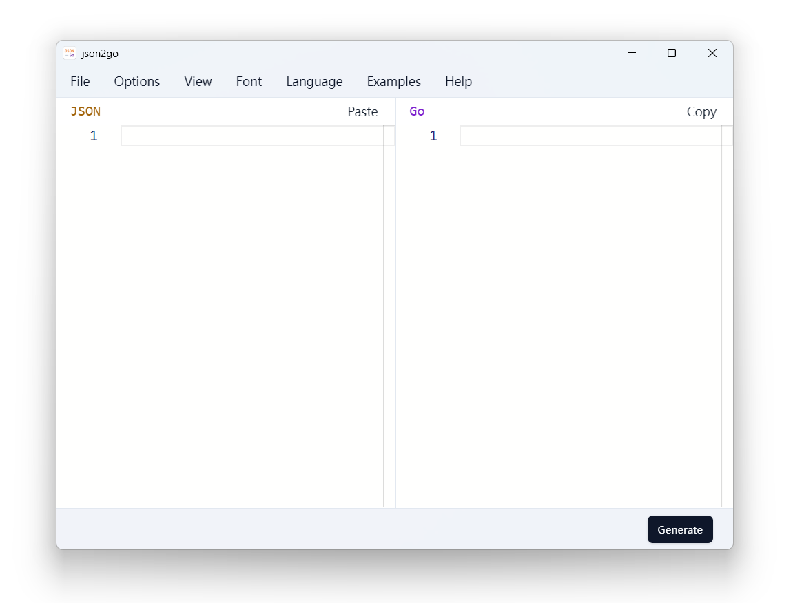

<div align="center">

# json2go

Generate Go type definitions from JSON
<br><br>
<a href="https://github.com/fhluo/json2go/blob/main/LICENSE">
  
</a>
<a href="https://github.com/fhluo/json2go/actions/workflows/build.yaml">
  
</a>
<a href="https://goreportcard.com/report/github.com/fhluo/json2go">
  
</a>

<samp>

**[English](readme.md)** ┃ **[简体中文](readme.zh-Hans.md)**

</samp>



</div>

## Build

### Windows

1. Install [Go](https://go.dev/dl/)
2. Install [Node.js](https://nodejs.org/zh-cn/)
3. Install [Task](https://taskfile.dev/installation/)

    ```PowerShell
    go install github.com/go-task/task/v3/cmd/task@latest
    ```

4. Get the source code of [json2go](https://github.com/fhluo/json2go)

   ```PowerShell
   git clone https://github.com/fhluo/json2go.git
   cd json2go
   ```

5. Install [Wails CLI](https://wails.io/docs/gettingstarted/installation)

    ```PowerShell
    task install-wails-cli
    ```

6. Install frontend dependencies

   ```PowerShell
    task install-web-deps
   ```

7. Build

   ```PowerShell
    task build
   ```

#### Optional

##### Install NSIS and UPX manually

- Install [NSIS](https://nsis.sourceforge.io/Download) and add the NSIS `Bin` directory to the `Path` environment variable
- Install [UPX](https://github.com/upx/upx/releases/latest) and add its directory to the `Path` environment variable

##### Install NSIS and UPX by using the setup tool

```PowerShell
go run .\tools\setup --upx --nsis
```

Temporarily add the NSIS `Bin` directory and the UPX installation directory to the environment variables (PowerShell)

```PowerShell
 $env:Path = (Get-ChildItem -Directory -Path .\build\tools\ | Where-Object { $_.Name -match "^nsis-" }).FullName + "\Bin" + ";" + $env:Path
 $env:Path = (Get-ChildItem -Directory -Path .\build\tools\ | Where-Object { $_.Name -match "^upx-" }).FullName + ";" + $env:Path
```

##### Build

```PowerShell
wails build -nsis -upx
```
