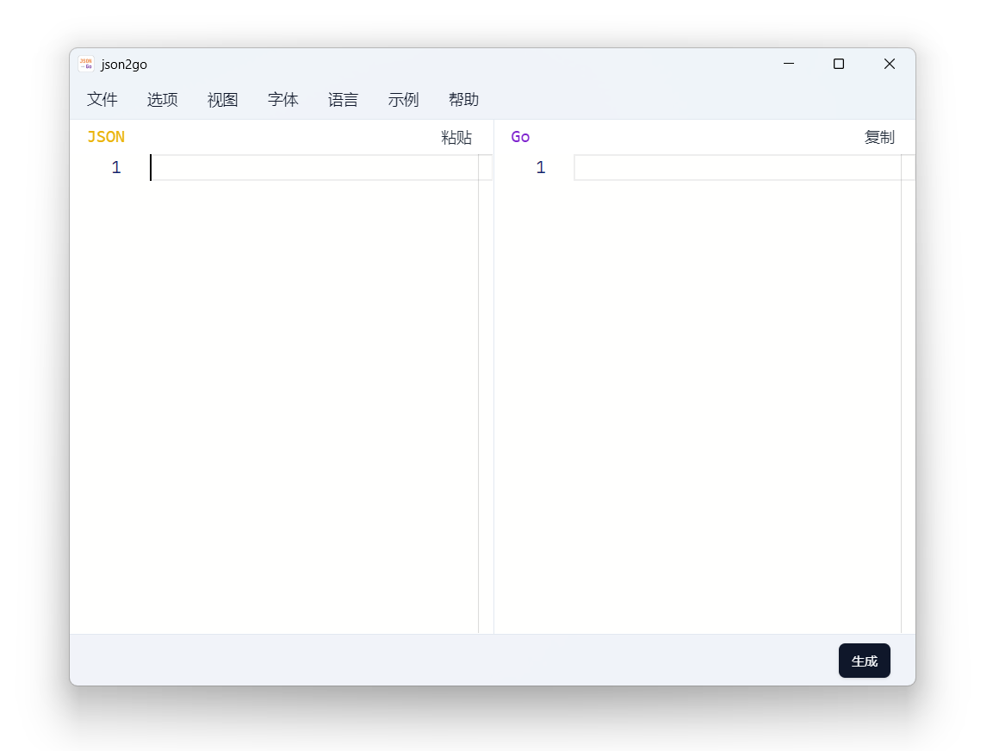

<div align="center">

# json2go

从 JSON 生成 Go 类型定义
<br><br>
<a href="https://github.com/fhluo/json2go/blob/main/LICENSE">
  
</a>
<a href="https://github.com/fhluo/json2go/actions/workflows/build.yaml">
  
</a>
<a href="https://goreportcard.com/report/github.com/fhluo/json2go">
  
</a>

<samp>

**[English](readme.md)** ┃ **[简体中文](readme.zh-Hans.md)**

</samp>



</div>

## 构建

### Windows

1. 安装 [Go](https://go.dev/dl/)
2. 安装 [Node.js](https://nodejs.org/zh-cn/)
3. 安装 [Task](https://taskfile.dev/installation/)

    ```PowerShell
    go install github.com/go-task/task/v3/cmd/task@latest
    ```

4. 获取 [json2go](https://github.com/fhluo/json2go) 的源码

   ```PowerShell
   git clone https://github.com/fhluo/json2go.git
   cd json2go
   ```

5. 安装 [Wails CLI](https://wails.io/docs/gettingstarted/installation)

    ```PowerShell
    task install-wails-cli
    ```

6. 安装前端依赖

   ```PowerShell
   task install-web-deps
   ```

7. 构建

   ```PowerShell
   task build
   ```

#### 可选

##### 手动安装 NSIS 和 UPX

- 安装 [NSIS](https://nsis.sourceforge.io/Download) 并将 NSIS 的 `Bin` 目录加入 `Path` 环境变量
- 安装 [UPX](https://github.com/upx/upx/releases/latest) 并将其目录加入 `Path` 环境变量

##### 使用安装工具安装 NSIS 和 UPX

```PowerShell
go run .\tools\setup --upx --nsis
```

临时将 NSIS 的 `Bin` 目录和 UPX 安装目录加入环境变量（PowerShell）

```PowerShell
 $env:Path = (Get-ChildItem -Directory -Path .\build\tools\ | Where-Object { $_.Name -match "^nsis-" }).FullName + "\Bin" + ";" + $env:Path
 $env:Path = (Get-ChildItem -Directory -Path .\build\tools\ | Where-Object { $_.Name -match "^upx-" }).FullName + ";" + $env:Path
```

##### 构建

```PowerShell
wails build -nsis -upx
```
